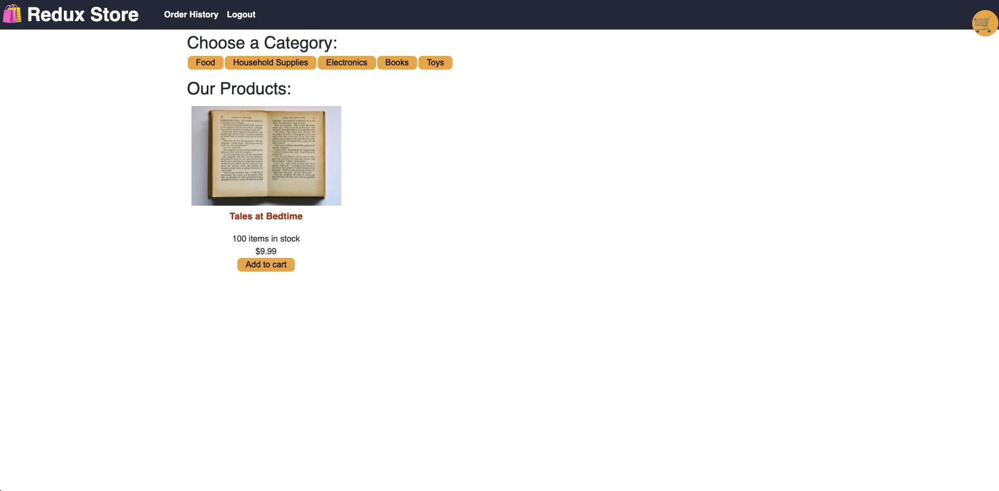
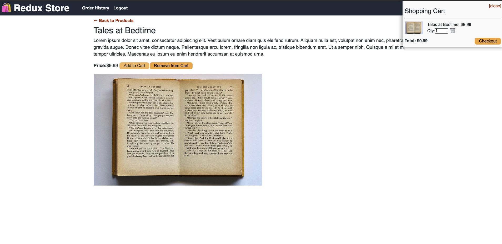

# Redux Store

## Description
Starting with a functioning website, [Shop-Shop](https://boiling-spire-00778.herokuapp.com/), I refactored the use of state to implement Redux in place of the React Context API.

## Table Of Contents
* [Usage](#usage)
* [License](#license)
* [Contributions](#contributions)
* [Questions](#questions)

## Usage
To use this application simply visit the deployed site and navigate through using the links provided at the top of the page. You can access the deployed site [here](https://dashboard.heroku.com/apps/joli-monsieur-99469)

## Contributing
This project was refactored by [lacey-griffith](https://github.com/lacey-griffith) with starter code from the coding bootcamp.

## Questions
If you have any questions please contact me at lacey.griffith04@gmail.com.
You can also visit my GitHub profile by clicking [here](https://github.com/lacey-griffith) and the repository for this project can be found [here](https://github.com/lacey-griffith/redux-store).

## Site Images
A user visits the application and clicks on 'Signup'

A user then is logged in and sees all the products available

When a category is chosen, only those products in the selected category are displayed.

When a product is selected, the user sees more details on that product.

The item is then added to the cart in the user's choise of quantity

When 'checkout' is clicked, the user is redirected to the payment page via stripe.

Once the payment is confirmed, the user sees a success page before being redirected to the home page

A user can view past purchases by clicking on 'order history'
